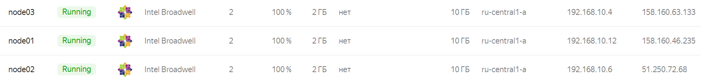
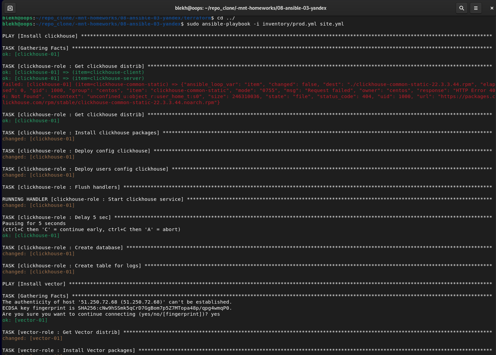
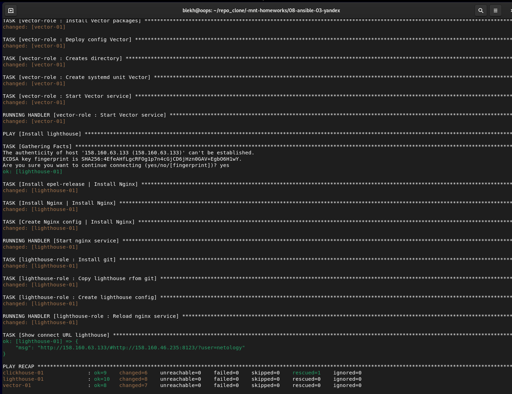
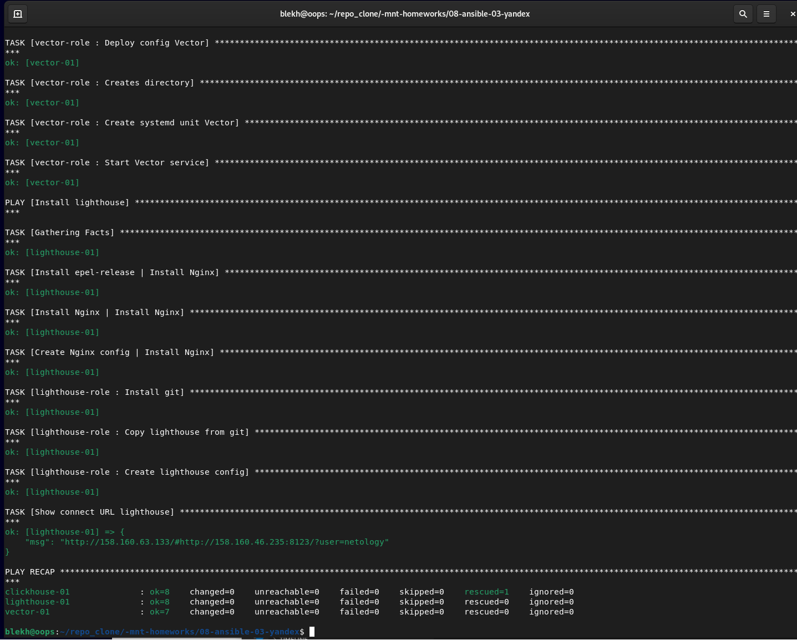
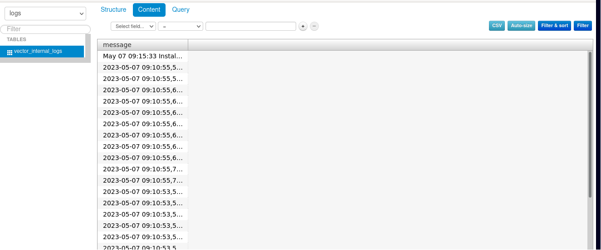

# Задание 08-ansible-03-yandex

## Подготовка к выполнению

1. Подготовьте в Yandex Cloud три хоста: для `clickhouse`, для `vector` и для `lighthouse`.

## Основная часть

1. Допишите playbook: нужно сделать ещё один play, который устанавливает и настраивает lighthouse.
2. При создании tasks рекомендую использовать модули: `get_url`, `template`, `yum`, `apt`.
3. Tasks должны: скачать статику lighthouse, установить nginx или любой другой webserver, настроить его конфиг для открытия lighthouse, запустить webserver.
4. Приготовьте свой собственный inventory файл `prod.yml`.
5. Запустите `ansible-lint site.yml` и исправьте ошибки, если они есть.
6. Попробуйте запустить playbook на этом окружении с флагом `--check`.
7. Запустите playbook на `prod.yml` окружении с флагом `--diff`. Убедитесь, что изменения на системе произведены.
8. Повторно запустите playbook с флагом `--diff` и убедитесь, что playbook идемпотентен.
9. Подготовьте README.md файл по своему playbook. В нём должно быть описано: что делает playbook, какие у него есть параметры и теги.
10. Готовый playbook выложите в свой репозиторий, поставьте тег `08-ansible-03-yandex` на фиксирующий коммит, в ответ предоставьте ссылку на него.

### Ответ
- Подготовка инфраструктуры для выполнения задания: c помощью terraform в Яндекс Cloud созданы 3 виртуальные машины:
 
- Инвентори `prod.yml` собирает terraform (terraform/inventory.tf) в процессе инициализации инфраструктуры 
- Реализована возможность автоматического запуска плейбука site.yml terraform (terraform/ansible.tf) после создагия виртуальных машин в YC и формирования inventory
- В плейбук site.yml добавлен play, который устанавливает и настраивает lighthouse (pre_tasks - установка и настройка nginx)
- Изменена структура playbook - роли по установке и настройке требуемых компонентов `clickhouse-role`,  `vector-role` и  `lighthouse-role` выделены в отдельную структуру. 
- Запуск playbook site.yml

- Запуск playbook на `prod.yml` окружении с флагом `--diff`

- В конце выполнения плейбука получена строка (msg) для подключения к lighthouse  
При подключении видим записанные в созданную БД данные:
    
  
