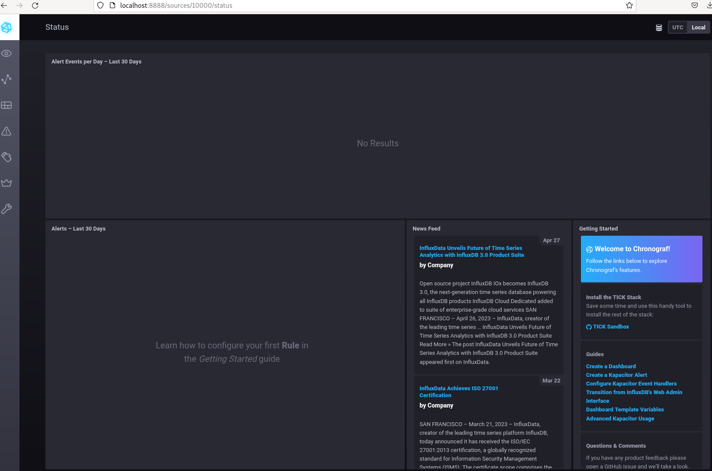
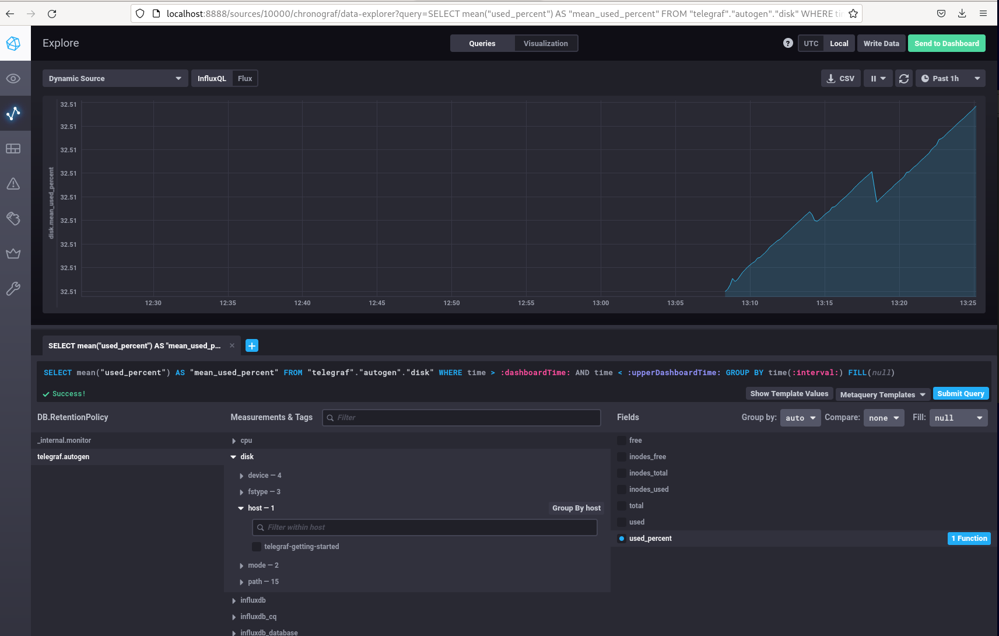
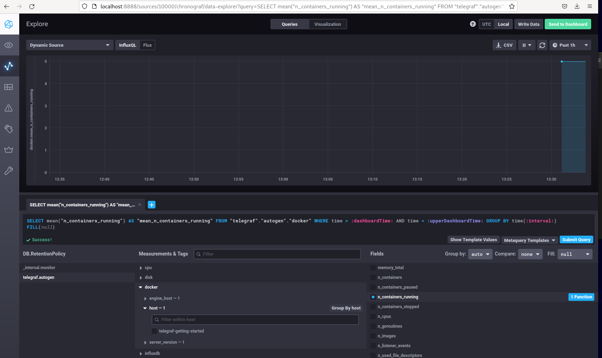

# Домашнее задание к занятию 13 «Системы мониторинга»

## Обязательные задания

1. Вас пригласили настроить мониторинг на проект. На онбординге вам рассказали, что проект представляет из себя платформу для вычислений с выдачей текстовых отчётов, которые сохраняются на диск. 
Взаимодействие с платформой осуществляется по протоколу http. Также вам отметили, что вычисления загружают ЦПУ. Какой минимальный набор метрик вы выведите в мониторинг и почему?
#### Время отклика
•	Количество запросов в секунду   
•	Среднее время отклика   
•	Максимальное время отклика
#### Мониторинг трафика
•	Количество HTTP/S запросов к приложению
#### Уровень ошибок
•	Процент корректных ответов пользователям (отсутствие 400х кодов)   
•	Количество отчетов в работе   
•	Количество ошибок по отчетам   
#### Степень загруженности системы
•	Метрики утилизации CPU: Общее использование и нагрузка, оказываемая приложением    
•	Метрики RAM – количество занятой и оставшейся памяти   
•	Метрики HDD – нагрузка на диск, свободное место, изношенность дисков)   
#

2. Менеджер продукта, посмотрев на ваши метрики, сказал, что ему непонятно, что такое RAM/inodes/CPUla. Также он сказал, что хочет понимать, насколько мы выполняем свои обязанности перед клиентами и какое качество обслуживания. Что вы можете ему предложить?   
Необходимо заключить соглашение SLA, в рамка которого обозначить и согласовать целевые показатели SLO. После этого для понимания качества обслуживания на проекте менеджеру нужно будет отслеживать индикатор качества обслуживания – SLI, не вникая в подробности работы той или иной метрики.
#
3. Вашей DevOps-команде в этом году не выделили финансирование на построение системы сбора логов. Разработчики, в свою очередь, хотят видеть все ошибки, которые выдают их приложения. Какое решение вы можете предпринять в этой ситуации, чтобы разработчики получали ошибки приложения?   
Как вариант – использовать Sentry - полномасштабный инструмент мониторинга ошибок, вылову и дебагу ошибок в проде. Ошибки ловятся в режиме реального времени, каждая ошибка включает информацию о среде выполнения и данных пользователей. Стоимость для использования на своих мощностях — бесплатно.
#
4. Вы, как опытный SRE, сделали мониторинг, куда вывели отображения выполнения SLA = 99% по http-кодам ответов. 
Этот параметр вычисляется по формуле: summ_2xx_requests/summ_all_requests. Он не поднимается выше 70%, но при этом в вашей системе нет кодов ответа 5xx и 4xx. Где у вас ошибка?   
Правильная формула:
(summ_2xx_requests + summ_3xx_requests)/(summ_all_requests)
#
5. Опишите основные плюсы и минусы pull и push систем мониторинга.   
#### push-модель:
Плюсы:   
- упрощение репликации данных в разные системы мониторинга или их резервные копии   
- более гибкая настройка отправки пакетов данных с метриками   
- UDP — это менее затратный способ передачи данных, из-за чего может возрасти производительность сбора метрик
  
Один из недостатков - если у нас распределенный парк хостов и служб, которые передают данные в центральную точку, есть риск перегрузки из-за большого количества входящих подключений одновременно.

#### pull-модель:   
Плюсы:   
 - легче контролировать подлинность данных   
 - можно настроить единый proxy server до всех агентов с TLS   
 - упрощённая отладка получения данных с агентов
   
Недостаток - более высокие требования к ресурсам.
#
6. Какие из ниже перечисленных систем относятся к push модели, а какие к pull? А может есть гибридные?

    - Prometheus push и pull
    - TICK push
    - Zabbix push и pull
    - VictoriaMetrics push и pull
    - Nagios pull
#
7. Склонируйте себе [репозиторий](https://github.com/influxdata/sandbox/tree/master) и запустите TICK-стэк, 
используя технологии docker и docker-compose.

В виде решения на это упражнение приведите скриншот веб-интерфейса ПО chronograf (`http://localhost:8888`). 

P.S.: если при запуске некоторые контейнеры будут падать с ошибкой - проставьте им режим `Z`, например
`./data:/var/lib:Z`

#
8. Перейдите в веб-интерфейс Chronograf (`http://localhost:8888`) и откройте вкладку `Data explorer`.

    - Нажмите на кнопку `Add a query`
    - Изучите вывод интерфейса и выберите БД `telegraf.autogen`
    - В `measurments` выберите mem->host->telegraf_container_id , а в `fields` выберите used_percent. 
    Внизу появится график утилизации оперативной памяти в контейнере telegraf.
    - Вверху вы можете увидеть запрос, аналогичный SQL-синтаксису. 
    Поэкспериментируйте с запросом, попробуйте изменить группировку и интервал наблюдений.

Для выполнения задания приведите скриншот с отображением метрик утилизации места на диске 
(disk->host->telegraf_container_id) из веб-интерфейса.   
 Метрики disk->host->telegraf_container_id:
 
 
#
9. Изучите список [telegraf inputs](https://github.com/influxdata/telegraf/tree/master/plugins/inputs). 
Добавьте в конфигурацию telegraf следующий плагин - [docker](https://github.com/influxdata/telegraf/tree/master/plugins/inputs/docker):
```
[[inputs.docker]]
  endpoint = "unix:///var/run/docker.sock"
```

Дополнительно вам может потребоваться донастройка контейнера telegraf в `docker-compose.yml` дополнительного volume и 
режима privileged:
```
  telegraf:
    image: telegraf:1.4.0
    privileged: true
    volumes:
      - ./etc/telegraf.conf:/etc/telegraf/telegraf.conf:Z
      - /var/run/docker.sock:/var/run/docker.sock:Z
    links:
      - influxdb
    ports:
      - "8092:8092/udp"
      - "8094:8094"
      - "8125:8125/udp"
```

После настройке перезапустите telegraf, обновите веб интерфейс и приведите скриншотом список `measurments` в 
веб-интерфейсе базы telegraf.autogen . Там должны появиться метрики, связанные с docker.
 
